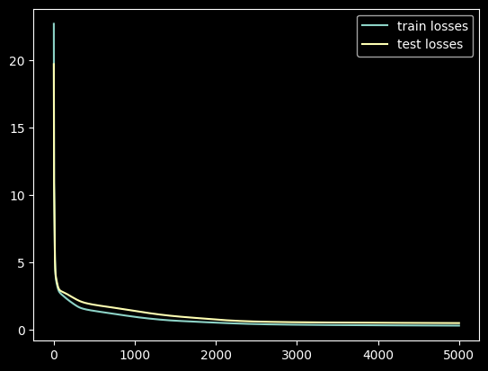
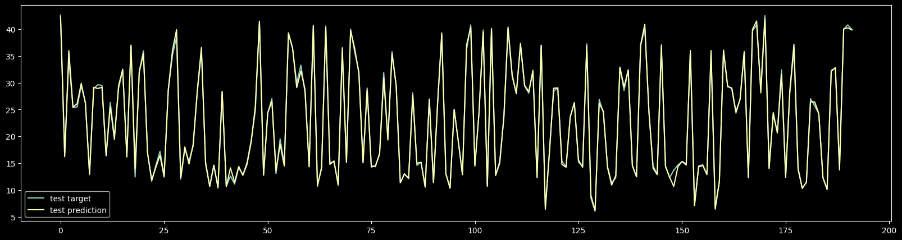

# DL HW1

## [Regression](./regression.ipynb)

### Network Architecture

```python
INPUT_FEATURES = train_feature.shape[1] # 17

Model([
    layer.Linear(INPUT_FEATURES, 16),
    layer.Sigmoid(),
    layer.Linear(16, 4),
    layer.Sigmoid(),
    layer.Linear(4, 1),
])
```

### Learning Curve

- epoch: 5000
- batch size: 128
- optimizer: sgd
- learning rate: 0.01



| epoch | train rms error | test rms error |
| ----- | --------------- | -------------- |
| 999   | 0.928578        | 1.074682       |
| 1999  | 0.744258        | 0.905798       |
| 2999  | 0.685659        | 0.860051       |
| 3999  | 0.653567        | 0.843214       |
| 4999  | 0.630212        | 0.839666       |

### Prediction

- train


- test


### Feature Importance

To select the most important features, I remain each feature and remove the rest. Then calculate the loss of the output. The feature with the lowest loss is the most important feature.

The result is:
`Overall Height` > `Relative Compactness` > `Glazing Area` > `Glazing Area Distribution` > `Roof Area` > `Orientation` > `Wall Area` > `Surface Area`

## Classification
