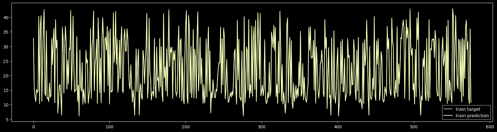

# DL HW1

## [Regression](./regression.ipynb)

### Network Architecture

```python
INPUT_FEATURES = train_feature.shape[1] # 17

Model([
    layer.Linear(INPUT_FEATURES, 16),
    layer.Sigmoid(),
    layer.Linear(16, 4),
    layer.Sigmoid(),
    layer.Linear(4, 1),
])
```

### Learning Curve

- epoch: 5000
- batch size: 128
- optimizer: sgd
- learning rate: 0.01
- loss

    

| epoch | train rms error | test rms error |
| ----- | --------------- | -------------- |
| 999   | 0.957335        | 1.396751       |
| 1999  | 0.525375        | 0.756762       |
| 2999  | 0.372102        | 0.558052       |
| 3999  | 0.331808        | 0.519184       |
| 4999  | 0.306968        | 0.495984       |

### Prediction

- train

    

- test

    

### Feature Importance

To select the most important features, I remain each feature and remove the rest. Then calculate the loss of the output. The feature with the lowest loss is the most important feature.

The result is:
`Overall Height` > `Roof Area` > `Relative Compactness` > `Wall Area` > `Glazing Area` > `Orientation` > `Surface Area` > `Glazing Area Distribution`

## [Classification](classification.ipynb)

### Network Architecture

```python
INPUT_FEATURES = train_feature.shape[1] # 34

model = Model([
    layer.Linear(INPUT_FEATURES, 8),
    layer.Sigmoid(),
    layer.Linear(8, 2),
    layer.Sigmoid(),
    layer.Linear(2, 1),
    layer.Sigmoid(),
])
```

### Learning Curve

- epoch: 5000
- batch size: 64
- optimizer: sgd
- learning rate: 0.03
- loss

    

- accuracy

    

| epoch | train loss | test loss | train acc | test acc |
| ----- | ---------- | --------- | --------- | -------- |
| 999   | 0.387957   | 0.374591  | 0.864285  | 0.887323 |
| 1999  | 0.150813   | 0.241346  | 0.960714  | 0.887323 |
| 2999  | 0.092493   | 0.193294  | 0.982142  | 0.915492 |
| 3999  | 0.065031   | 0.182027  | 0.982142  | 0.957746 |
| 4999  | 0.041833   | 0.194160  | 0.989285  | 0.957746 |

### Latent Features

I trained two models with different number of latent features. One it as above, the other has 3 nodes in the layer before the output layer.

- 2 nodes
  
    
    

- 3 nodes
  
    
    

From the observation, we can see that both models can separate the data into two clusters. However, the model with 3 nodes can separate the data better.
