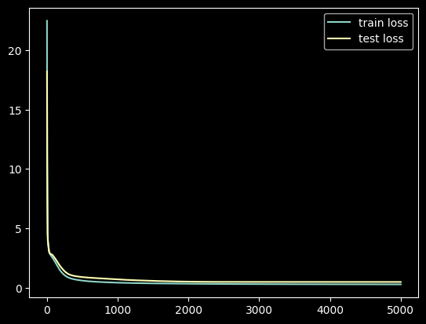
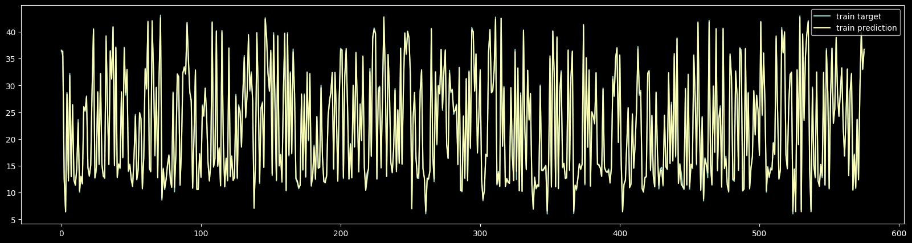

# DL HW1

## [Regression](./regression.ipynb)

### Network Architecture

```python
INPUT_FEATURES = train_feature.shape[1] # 17

Model([
    layer.Linear(INPUT_FEATURES, 16),
    layer.Sigmoid(),
    layer.Linear(16, 4),
    layer.Sigmoid(),
    layer.Linear(4, 1),
])
```

### Learning Curve

- epoch: 5000
- batch size: 128
- optimizer: sgd
- learning rate: 0.01



| epoch | train rms error | test rms error |
| ----- | --------------- | -------------- |
| 999   | 0.540492        | 0.849442       |
| 1999  | 0.360476        | 0.723202       |
| 2999  | 0.302459        | 0.620422       |
| 3999  | 0.276680        | 0.570541       |
| 4999  | 0.261528        | 0.541976       |

### Prediction

- train


- test


### Feature Importance

## Classification
